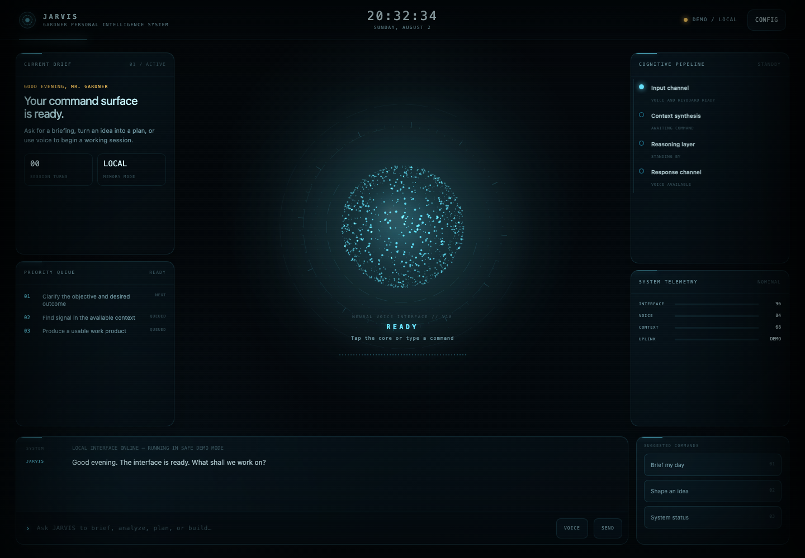

# JARVIS Interface

A cinematic, voice-first personal intelligence interface built as a single-page HTML prototype.

## What is included

- Responsive desktop and mobile layouts
- Animated particle core with idle, listening, thinking, responding, and error states
- Keyboard and browser speech-recognition input
- Conversation history and suggested commands
- Immediate demo mode with no credentials required
- Provider-neutral configuration language for future backend integrations
- Optional ElevenLabs speech output in the current local prototype

## Run locally

Open `index.html` in a browser. Demo mode works immediately.

Microphone access is more reliable when the page is served from a local web server rather than opened directly from disk.

## Security status

This repository is a visual and interaction prototype. Do not hard-code provider credentials or publish a version containing API keys. The current experimental live connector accepts credentials in browser memory for local testing only. A production version should route AI and voice requests through a secure backend that reads credentials from environment variables.

## Current direction

The interface is intentionally provider-neutral. The next development step is a secure local backend with selectable reasoning depth and a provider adapter, while preserving the standalone demo experience.
